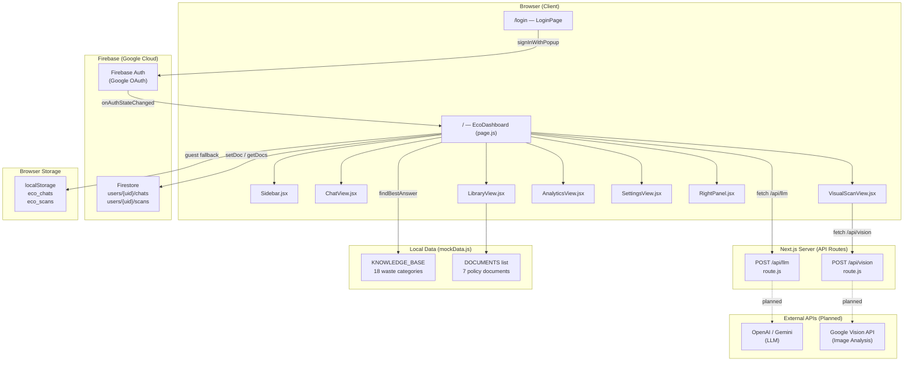
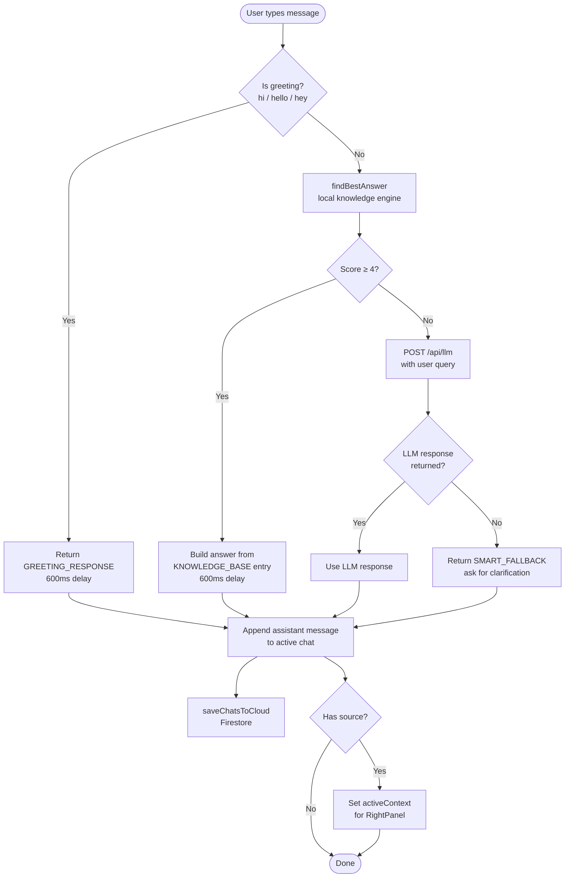
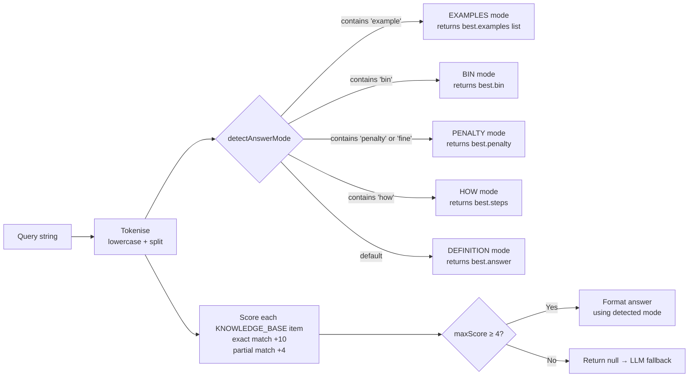
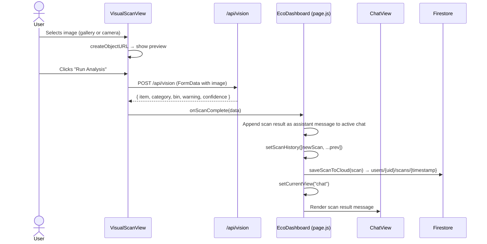
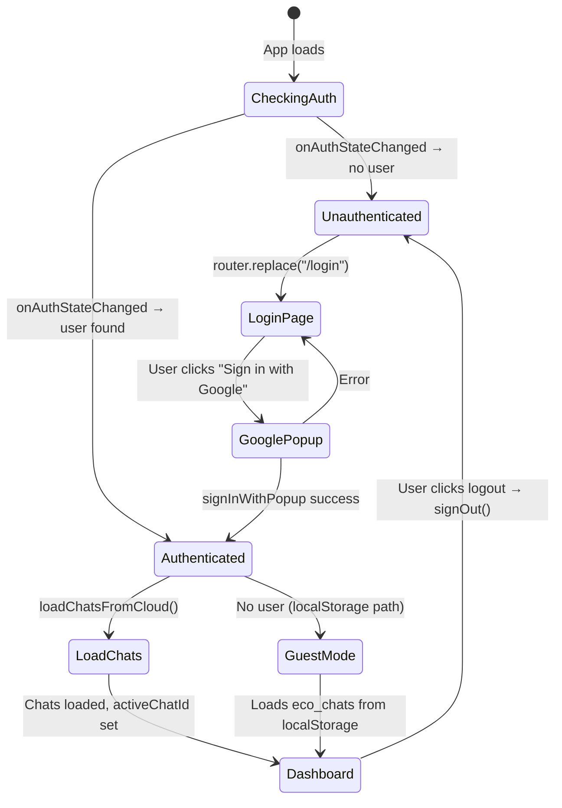
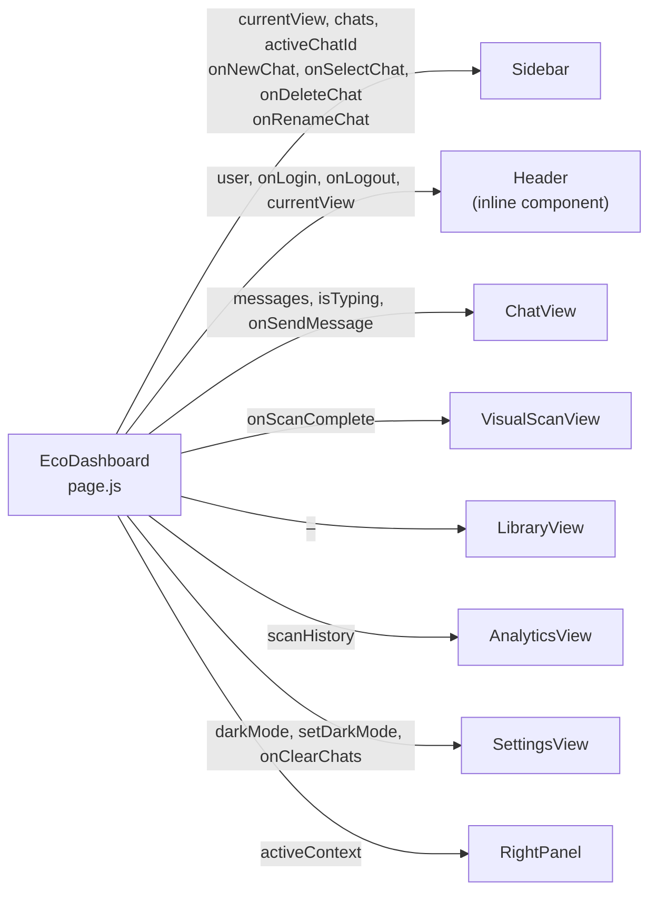
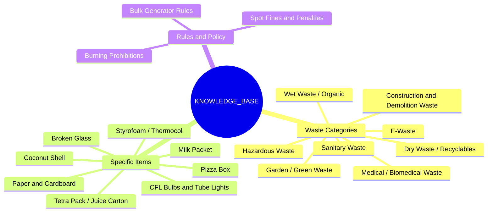
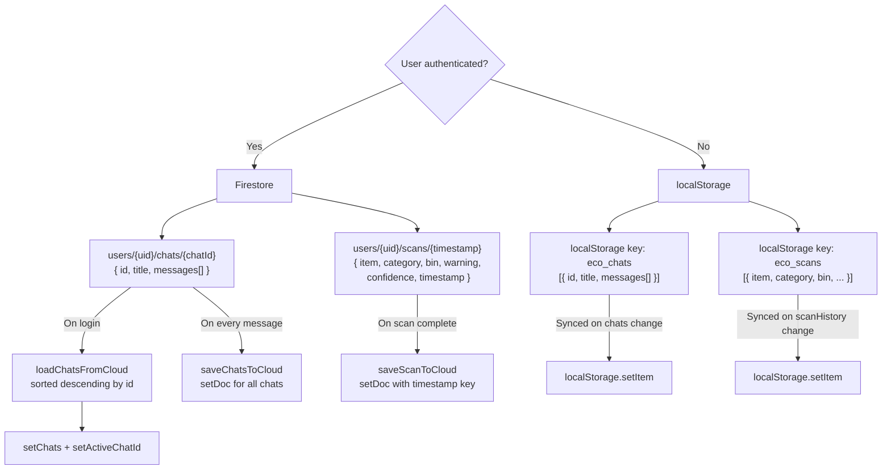

# 🌱 Eco-Guide AI

**An AI-powered municipal waste segregation and visual identification platform** built for urban citizens to understand and comply with local solid waste management rules.

> Eco-Guide provides an interactive chat assistant backed by a curated knowledge base of Indian waste regulations (BBMP, SWM Rules 2016, E-Waste Rules 2022, NGT orders), a visual scan tool for image-based waste identification, a policy document library, and a scan analytics dashboard — all wrapped in a clean, responsive, dark-mode-capable interface.

---

## Table of Contents

- [Overview](#overview)
- [Features](#features)
- [Tech Stack](#tech-stack)
- [Project Structure](#project-structure)
- [Architecture](#architecture)
- [Application Flow](#application-flow)
- [Component Breakdown](#component-breakdown)
- [API Routes](#api-routes)
- [Knowledge Base](#knowledge-base)
- [Data Storage Strategy](#data-storage-strategy)
- [Authentication Flow](#authentication-flow)
- [Getting Started](#getting-started)
- [Environment Variables](#environment-variables)
- [Current Status & Known Placeholders](#current-status--known-placeholders)
- [Roadmap](#roadmap)

---

## Overview

Eco-Guide AI is a **Next.js 14 (App Router)** single-page dashboard that helps users identify waste categories, understand disposal rules, and stay compliant with municipal regulations. It uses a hybrid AI approach:

1. **Local Knowledge Engine** — a keyword-scored matcher against a hand-curated `KNOWLEDGE_BASE` of waste categories, bin colours, penalties, and disposal steps sourced from BBMP bye-laws, SWM Rules 2016, E-Waste Rules 2022, and NGT orders.
2. **LLM Fallback** — when the local engine does not find a confident match, the query is forwarded to `/api/llm`, which is scaffolded for OpenAI / Gemini integration (currently returns a placeholder).
3. **Vision API** — the Visual Scan view uploads an image to `/api/vision`, which is scaffolded for Google Vision / Gemini Vision (currently returns a mock result).

---

## Features

| Feature | Description |
|---|---|
| 💬 **Chat Assistant** | Conversational interface with typing animation, source attribution, and suggestion cards |
| 🔍 **Smart Matcher** | Keyword-scoring engine with intent detection (BIN / EXAMPLES / HOW / PENALTY / DEFINITION modes) |
| 📸 **Visual Scan** | Upload or capture an image; the result is injected back into the active chat as an AI message |
| 📚 **Policy Library** | Browseable grid of regulatory documents (BBMP, SWM Rules, E-Waste Rules, etc.) with search and filter UI |
| 📊 **Scan Analytics** | Per-session stats: total scans, most common waste category, hazardous item count, and category breakdown |
| 🔐 **Google Auth** | Firebase Google OAuth with session persistence; unauthenticated users are redirected to `/login` |
| ☁️ **Cloud Sync** | Firestore stores chat history and scan history per user under `users/{uid}/chats` and `users/{uid}/scans` |
| 💾 **Local Fallback** | `localStorage` used for unauthenticated guests (`eco_chats`, `eco_scans` keys) |
| 🌙 **Dark Mode** | Full dark/light toggle with Tailwind `class` strategy; toggle persisted in React state |
| ✏️ **Chat Management** | Create, rename, delete, and search chats; history shown in sidebar with inline rename |
| 📌 **Context Panel** | Right panel shows the policy source that backed the last AI answer |

---

## Tech Stack

| Layer | Technology | Version |
|---|---|---|
| Framework | Next.js (App Router) | ^14.2.35 |
| UI Library | React | ^18 |
| Styling | Tailwind CSS | ^3.3.0 |
| Icons | Lucide React | ^0.562.0 |
| Auth | Firebase Authentication (Google) | ^12.8.0 |
| Database | Firebase Firestore | ^12.8.0 |
| LLM Client | OpenAI SDK (scaffolded) | ^6.16.0 |
| Vision API | Google Vision API (scaffolded) | — |
| Font | Manrope (Google Fonts) | — |
| Build Tools | PostCSS, Autoprefixer | — |

---

## Project Structure

```
eco-guide-ai/
├── src/
│   ├── app/
│   │   ├── api/
│   │   │   ├── llm/
│   │   │   │   └── route.js          # POST /api/llm — LLM fallback endpoint (placeholder)
│   │   │   └── vision/
│   │   │       └── route.js          # POST /api/vision — Image analysis endpoint (mock)
│   │   ├── login/
│   │   │   └── page.js               # /login — Google Sign-In page
│   │   ├── globals.css               # Tailwind base + custom scrollbar + fade-in-up animation
│   │   ├── layout.js                 # Root layout — Manrope font, metadata, html/body
│   │   └── page.js                   # / — Main dashboard (EcoDashboard root component)
│   ├── components/
│   │   ├── Sidebar.jsx               # Left nav: branding, navigation, chat history, recent scans
│   │   ├── RightPanel.jsx            # Right panel: policy context card, related sections, map placeholder
│   │   └── views/
│   │       ├── ChatView.jsx          # Message thread, typing indicator, suggestion cards, input bar
│   │       ├── VisualScanView.jsx    # File upload / camera capture + Run Analysis button
│   │       ├── LibraryView.jsx       # Policy document grid with search and filter
│   │       ├── AnalyticsView.jsx     # Scan stats summary cards + category breakdown
│   │       └── SettingsView.jsx      # Theme toggle, clear chats, storage/AI/security status
│   ├── data/
│   │   └── mockData.js               # KNOWLEDGE_BASE, DOCUMENTS list, RECENT_SCANS, THEME tokens
│   └── lib/
│       └── firebase.js               # Firebase app init (singleton), auth, provider, db exports
├── .gitignore
├── jsconfig.json                     # Path alias: @/* → ./src/*
├── next.config.js                    # (default, not customised)
├── package.json
├── postcss.config.js
├── tailwind.config.js                # Dark mode: 'class', custom colours (primary, bg-light, bg-dark)
└── README.md
```

---

## Architecture



---

## Application Flow

### Message Handling (Hybrid AI)



### Intent Detection in findBestAnswer



### Visual Scan Flow



---

## Authentication Flow



---

## Component Breakdown

### `page.js` — EcoDashboard (Root)

The root component owns all application state and passes data/handlers down to child views.



**State managed in `page.js`:**

| State variable | Type | Purpose |
|---|---|---|
| `darkMode` | boolean | Controls `dark` class on `<html>` |
| `currentView` | string | Active view: `"chat" \| "scan" \| "library" \| "analytics" \| "settings"` |
| `user` | object \| null | Firebase Auth user object |
| `authLoading` | boolean | Blocks render until auth check is complete |
| `chats` | array | All chat sessions `[{ id, title, messages[] }]` |
| `scanHistory` | array | All scan results `[{ item, category, bin, warning, confidence, timestamp }]` |
| `activeChatId` | string \| null | ID of the currently selected chat |
| `isTyping` | boolean | Shows typing indicator in ChatView |
| `activeContext` | object \| null | Policy context card data for RightPanel |

---

### `Sidebar.jsx`

| Section | Content |
|---|---|
| Brand | Eco-Guide logo (Leaf icon) + "Municipal AI" subtitle |
| Main Navigation | Visual Scan, Chat Assistant, Policy Guidelines, Analytics |
| New Chat | Button to create a new chat session |
| Chat History | Searchable, scrollable list of chats with inline rename and delete |
| Recent Scans | Static placeholder items (PET Plastic Bottle, Aluminum Can) |
| Settings | NavItem linking to SettingsView |

---

### `ChatView.jsx`

- **Empty state:** Three suggestion cards (E-waste Rules, 2025 Compliance, Penalty Schedule) with click-to-send.
- **Messages:** User messages right-aligned dark bubble; AI messages left-aligned with left green border, "Policy Answer" / "Verified" badges, source attribution, thumbs-up/down/copy actions.
- **New message animation:** `TypingEffect` component renders characters one by one at 10ms intervals.
- **Input bar:** Textarea with paperclip button (UI only), Send button, `Enter` to send, `Shift+Enter` for newline.

---

### `VisualScanView.jsx`

- Two hidden `<input type="file">` elements: one for gallery upload, one with `capture="environment"` for the device camera.
- Clicking the upload zone or the "Select File" button triggers the gallery input.
- A dedicated Camera button triggers the camera input.
- After selection, a preview of the image is shown.
- "Run Analysis" posts the image to `/api/vision` as `FormData`.
- On success, calls `onScanComplete(data)` which injects the result into the chat and switches the view back to `"chat"`.

---

### `AnalyticsView.jsx`

Receives `scanHistory` array from the root component and computes:
- **Total Scans** — `scanHistory.length`
- **Most Common Waste** — the category with the highest count
- **Hazardous Items** — count of entries where `category === "Hazardous Waste"`
- **Category Breakdown** — a list of each category and its count

---

### `LibraryView.jsx`

Renders a grid of document cards sourced from the `DOCUMENTS` array in `mockData.js`. Each card shows title, file type, size, last updated date, and a download button (UI only). Includes a search input and filter button (UI scaffolded, not yet wired).

---

### `SettingsView.jsx`

| Section | Settings |
|---|---|
| Appearance | Toggle dark / light mode |
| Chats | Clear all chat history (with `confirm()` dialog) |
| Storage | Local Storage: Active; Cloud Sync: Coming Soon |
| AI Engine | Local Knowledge Engine: Enabled; LLM Integration: Ready |
| Security | Data Privacy: Secure |

---

### `RightPanel.jsx`

Visible only at `xl` breakpoints. Displays:
- **Policy Context card** — dynamically updated after each AI response that carries a `source` field (`activeContext.title`, `activeContext.snippet`)
- **Related Sections** — static links (Sec 5.1: Penalties, Sec 2.4: Bin Colors)
- **Zonal Compliance Heatmap** — placeholder map area

---

## API Routes

### `POST /api/llm`

**File:** `src/app/api/llm/route.js`

Receives the user query and is intended to forward it to an LLM (OpenAI / Gemini). Currently returns a placeholder string.

```
Request body:  { "query": "string" }
Response:      { "text": "LLM response placeholder 🤖" }
```

**To activate:** Replace the placeholder with an OpenAI or Gemini call using the `openai` package (already in `dependencies`).

---

### `POST /api/vision`

**File:** `src/app/api/vision/route.js`  
**Runtime:** `nodejs`

Receives a base64 image, reads `GOOGLE_VISION_API_KEY` from environment variables, and is intended to call Google Vision / Gemini Vision. Currently returns a hard-coded mock result.

```
Request body:  { "imageBase64": "string" }  (note: VisualScanView currently sends FormData — a mismatch to resolve)
Response:      { "item": "Plastic Bottle", "category": "Dry Waste", "bin": "Blue Bin",
                 "warning": "Rinse before disposal", "confidence": 0.91 }
Error 400:     { "error": "No image provided" }
Error 500:     { "error": "Vision API key not configured" }
               { "error": "Vision analysis failed" }
```

> ⚠️ **Note:** `VisualScanView` sends the image as `FormData` (`formData.append("image", file)`), but `/api/vision/route.js` expects `{ imageBase64 }` in JSON. This mismatch must be resolved before connecting a real vision API.

---

## Knowledge Base

The `KNOWLEDGE_BASE` in `src/data/mockData.js` contains **18 entries** covering the following waste categories and regulatory topics:



Each entry has the following shape (all fields optional except `id`, `keywords`, `answer`):

```js
{
  id: "ewaste",
  category: "E-Waste",
  keywords: ["e-waste", "electronics", "battery", ...],
  answer: "E-waste must NEVER be mixed with regular trash...",
  examples: ["Mobile phones", "Chargers and cables", ...],
  bin: "No household bin – use authorized e-waste collection points",
  penalty: "₹5,000 fine under E-Waste Management Rules 2022",
  steps: ["Store separately from other waste", ...],
  source: "E-Waste Management Rules 2022",
  explanation: "Electronics contain heavy metals like Lead and Mercury..."
}
```

**Policy sources referenced in the knowledge base:**

- BBMP Solid Waste Management Bye-Laws 2019 (Schedule I & II)
- BBMP SWM Bye-Laws 2019
- BBMP Penalty Schedule 2025
- BBMP C&D Waste Policy 2023
- BBMP Dry Waste Guidelines
- E-Waste Management Rules 2022
- SWM Rules 2016 (Rule 4)
- Biomedical Waste Rules 2016
- Plastic Waste Management Rules
- Air Act 1981 / NGT Orders
- Carton Council of India Guidelines
- Worker Safety Protocol 2024
- Mercury Waste Handling Protocol
- Recycling Protocols v2

---

## Data Storage Strategy



---

## Getting Started

### Prerequisites

- Node.js 18+
- npm
- A Firebase project with **Authentication** (Google provider enabled) and **Firestore** set up

### Installation

```bash
git clone https://github.com/Javeria-taj/eco-guide-ai.git
cd eco-guide-ai
npm install
```

### Configuration

Create a `.env.local` file in the project root:

```env
# Firebase (currently hardcoded in src/lib/firebase.js — move here for security)
NEXT_PUBLIC_FIREBASE_API_KEY=your_api_key
NEXT_PUBLIC_FIREBASE_AUTH_DOMAIN=your_auth_domain
NEXT_PUBLIC_FIREBASE_PROJECT_ID=your_project_id
NEXT_PUBLIC_FIREBASE_STORAGE_BUCKET=your_storage_bucket
NEXT_PUBLIC_FIREBASE_MESSAGING_SENDER_ID=your_sender_id
NEXT_PUBLIC_FIREBASE_APP_ID=your_app_id

# Google Vision API (used in /api/vision)
GOOGLE_VISION_API_KEY=your_google_vision_key

# OpenAI (for /api/llm, when implemented)
OPENAI_API_KEY=your_openai_key
```

> ⚠️ **Security note:** Firebase config is currently hardcoded in `src/lib/firebase.js`. It should be moved to environment variables using `NEXT_PUBLIC_` prefixed keys.

### Run Development Server

```bash
npm run dev
```

Open [http://localhost:3000](http://localhost:3000).

### Build for Production

```bash
npm run build
npm run start
```

### Lint

```bash
npm run lint
```

---

## Environment Variables

| Variable | Used In | Required |
|---|---|---|
| `GOOGLE_VISION_API_KEY` | `/api/vision/route.js` | Yes (for vision features) |
| Firebase config values | `src/lib/firebase.js` | Yes (currently hardcoded) |
| `OPENAI_API_KEY` (or equivalent) | `/api/llm/route.js` | When LLM is wired up |

---

## Current Status & Known Placeholders

| Item | Status | Notes |
|---|---|---|
| Local knowledge engine | ✅ Working | 18 entries, keyword scoring, intent modes |
| Google Auth + Firestore | ✅ Working | Login, chat sync, scan sync |
| Dark mode toggle | ✅ Working | Tailwind `class` strategy |
| Chat history (create / rename / delete / search) | ✅ Working | Cloud and localStorage |
| Visual scan UI (upload + camera) | ✅ Working | File selection and preview |
| `/api/llm` | 🚧 Placeholder | Returns hardcoded string; OpenAI SDK is in `dependencies` |
| `/api/vision` | 🚧 Mock | Returns hardcoded `Plastic Bottle` result; `GOOGLE_VISION_API_KEY` env var checked but not used |
| Vision API ↔ client mismatch | ⚠️ Bug | `VisualScanView` sends `FormData`; route expects `{ imageBase64 }` JSON |
| Library search / filter | 🚧 UI only | Input and button rendered; no filtering logic implemented |
| Policy document downloads | 🚧 UI only | Download button rendered; no actual files linked |
| Right panel map | 🚧 Placeholder | `MapPin` icon shown; no map integration |
| Settings — Cloud Sync badge | 🚧 "Coming Soon" | Firestore is implemented for chats/scans but the badge still reads "Coming Soon" |
| Recent Scans in Sidebar | 🚧 Static | Shows hardcoded "PET Plastic Bottle" and "Aluminum Can"; not linked to live `scanHistory` |
| Firebase config in source | ⚠️ Security | Config hardcoded in `src/lib/firebase.js`; should use env vars |

---

## Roadmap

Based on code comments and scaffolded hooks in the codebase:

- [ ] Wire `/api/llm` to OpenAI or Gemini for real LLM answers
- [ ] Wire `/api/vision` to Google Vision API or Gemini Vision for real image classification
- [ ] Fix `FormData` vs `imageBase64` mismatch between `VisualScanView` and `/api/vision`
- [ ] Move Firebase config to `NEXT_PUBLIC_` environment variables
- [ ] Connect Sidebar "Recent Scans" section to live `scanHistory` state
- [ ] Implement Library search and filter functionality
- [ ] Link policy documents to real downloadable files
- [ ] Integrate a real map for the Zonal Compliance Heatmap
- [ ] Add mobile-responsive sidebar (currently hidden on small screens with `hidden md:flex`)
- [ ] Improve analytics with charts (scan trends over time, category pie chart)

---

## License

This project is private (`"private": true` in `package.json`). No license is currently declared.
